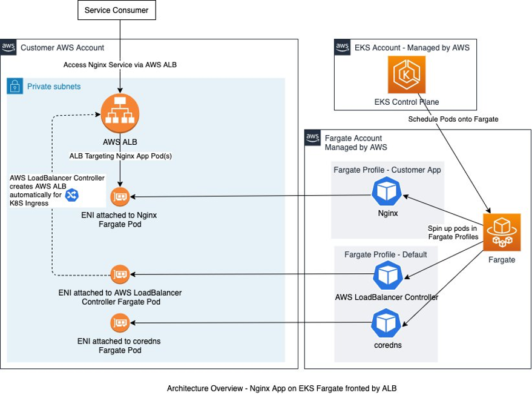
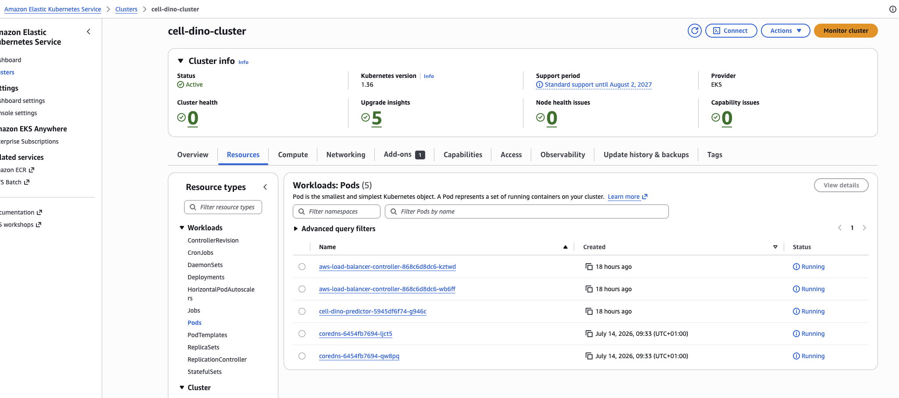
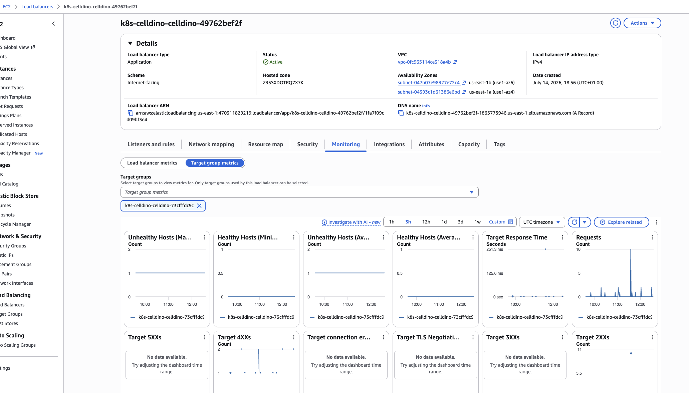
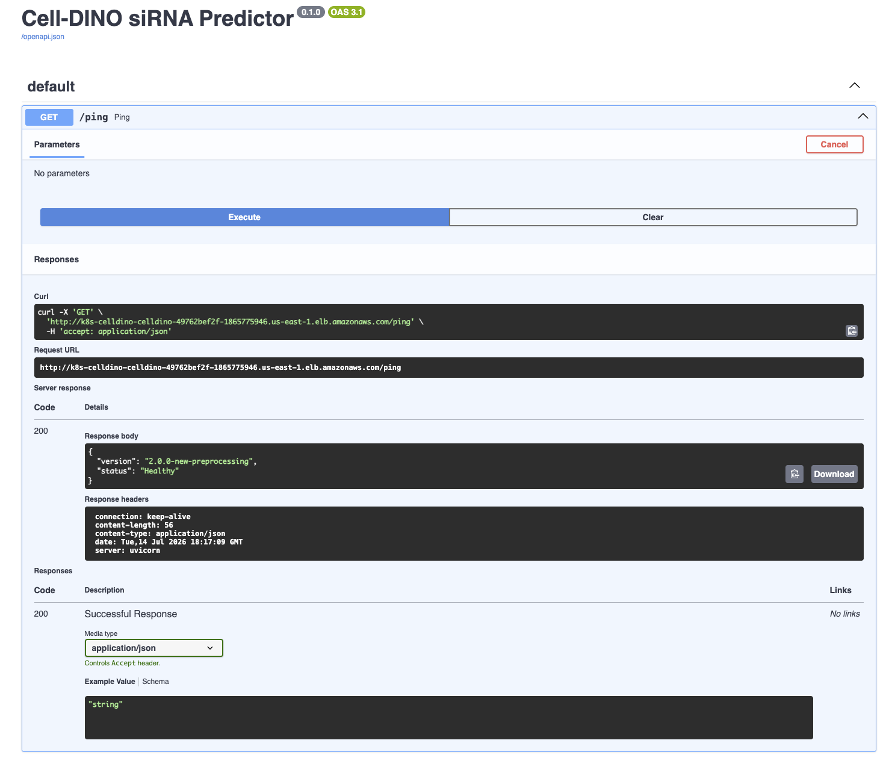
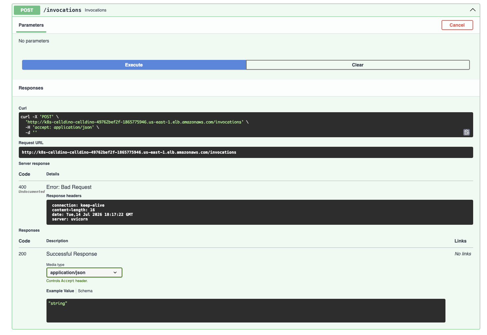

# Serverless DINOv2 Deep Learning Inference System on AWS EKS Fargate

> **Infrastructure Status Note:** To manage cloud expenses efficiently, the production EKS Fargate cluster is spun up dynamically via Terraform for testing cycles and torn down post-verification. The active deployment artifacts, logs, and live Swagger document verification have been recorded below as static proof of architecture completion.


## 💡 Cross-Repository Architecture & Cost-Effectiveness
To balance production-grade scalability with development cost constraints, this system is split across decoupled layers:

```
┌─────────────────────────────┐      ┌──────────────────────────────┐
│     Model & API Repo        │      │  EKS Infrastructure (This)   │
│  • FastAPI Application      ├─────►│  • Terraform Provisioned     │
│  • Container & Model Registr│      │  • AWS EKS Fargate Profiles  │
│  • Streamlit Web UI Demo    │      │  • App Load Balancer (ALB)   │
└──────────────┬──────────────┘      └──────────────┬───────────────┘
               │                                    │
               ▼                                    ▼
       (Zero-Cost Demo)                      (Dynamically Spun Up)
   Streamlit UI reads from                 Provides high-performance,
   S3 or Mock API for public use           serverless cluster validation
```

* **The Inference Codebase:** The core FastAPI model pipeline, Docker container configurations, and model weights are managed in a separate, isolated [code repository](https://github.com/Shabalina/cell-dino-api).
* **Cost-Efficient UI Demo:** A public [Streamlit Web UI[(https://shabalina-cell-dino-api-uiapp-uqmv5v.streamlit.app/) is coupled with that repository to demonstrate user interaction. For day-to-day hosting, the UI uses lightweight sagemaker serverless inference layers to keep runtime costs at zero.
* **On-Demand EKS Orchestration (This Repo):** This repository contains the complete Terraform and Kubernetes manifest state. When high-throughput validation or performance benchmarking is required, this enterprise EKS Fargate cluster is spun up, matches the model's active container registry image, runs its checks, and is safely torn down.


## 🏗️ Architecture Overview

The system uses an enterprise-grade, serverless Kubernetes design to host high-performance PyTorch model endpoints with zero sustained EC2 server overhead.



### Core Infrastructure Highlights
* **Serverless Compute (AWS Fargate):** Isolated, custom-sized runtime environments that hold the PyTorch weights permanently in memory, entirely bypassing server maintenance and serverless cold-start latency.
* **AWS Load Balancer Controller:** Dynamically provisions an Internet-facing Application Load Balancer mapping incoming HTTP port 80 targets directly to Fargate Pod IPs using VPC-native container routing (`target-type: ip`).
* **IAM Roles for Service Accounts (IRSA):** Connects the cluster’s OpenID Connect (OIDC) identity provider directly to AWS IAM. This securely grants the ingress controller pod the precise cloud permission scopes required to build and destroy AWS infrastructure assets dynamically without hardcoded access credentials.

<ins>**EKS running pods - 2 x core DNS, 2 x ALB controller, 1 x model app**<ins>



<ins>**ALB monitoring screenshot**<ins>


---

## 🖼️ Deployment Proof of Work

### 1. Interactive API Gateway (FastAPI Swagger UI)
The system dynamically exposes its machine learning signature via FastAPI's documentation layer, hosted natively behind the AWS Application Load Balancer:
```http://k8s-celldino-[...].us-east-1.elb.amazonaws.com/docs```

<ins>**Swagger UI /health enpoint**<ins>


<ins>**Swagger UI /predictions enpoint**<ins>


### 2. High-Performance Test Batch Run Logs
Using a Python script, raw image files are streamed down sequentially from an external S3 bucket directly to the ALB's /invocations endpoint as raw binary payloads.

This pipeline proves the Fargate model pod successfully ingests and decodes raw byte-streams to output predictions under 1 second without experiencing cold starts.

**test code snippet:**
```python script to load images from s3 as bytes and send them for the model inference for prediction with confidence score
for index, s3_key in enumerate(image_keys, start=1):
    filename = os.path.basename(s3_key)
    print(f"[{index}/10] Downloading: {filename}")
    
    try:
        file_stream = io.BytesIO()
        s3_client.download_fileobj(S3_BUCKET, s3_key, file_stream)
        image_bytes = file_stream.getvalue()
    except Exception as s3_err:
        print(f"Failed downloading from S3: {s3_err}")
        continue

    content_type = "image/png" if filename.lower().endswith((".png")) else "image/jpeg"

    print(f"Sending bytes to ALB /invocations...")
    try:
        # POST the raw binary payload directly in the body
        response = requests.post(
            INVOCATIONS_URL,
            data=image_bytes,
            headers={"Content-Type": content_type},
            timeout=30  # Standard timeout safety window
        )
        
        # Check response status
        if response.status_code == 200:
            prediction = response.json()
            print(f"Success! Response: {prediction}")
        else:
            print(f"API returned Error Code {response.status_code}: {response.text}")
            
    except requests.exceptions.RequestException as req_err:
        print(f"Failed connecting to Inference Endpoint: {req_err}")

    print("-" * 60)

print("Inference batch run complete!")
```

**invocation results:**
```
[1/10] ⬇️ Downloading: HEPG2-01_1_H09_s1.jpeg
       📤 Sending bytes to ALB /invocations...
   🎉 Success! Response: {'sirna_id': 352, 'confidence': 0.14357472956180573, 'status': 'success'}
------------------------------------------------------------
[2/10] ⬇️ Downloading: HEPG2-01_2_E03_s1.jpeg
       📤 Sending bytes to ALB /invocations...
   🎉 Success! Response: {'sirna_id': 902, 'confidence': 0.2267337143421173, 'status': 'success'}
------------------------------------------------------------
[3/10] ⬇️ Downloading: HEPG2-01_3_O08_s1.jpeg
       📤 Sending bytes to ALB /invocations...
   🎉 Success! Response: {'sirna_id': 186, 'confidence': 0.07514588534832001, 'status': 'success'}
------------------------------------------------------------
[4/10] ⬇️ Downloading: HEPG2-01_4_K16_s2.jpeg
       📤 Sending bytes to ALB /invocations...
   🎉 Success! Response: {'sirna_id': 870, 'confidence': 0.24030183255672455, 'status': 'success'}
------------------------------------------------------------
[5/10] ⬇️ Downloading: HEPG2-02_1_F13_s2.jpeg
       📤 Sending bytes to ALB /invocations...
   🎉 Success! Response: {'sirna_id': 520, 'confidence': 0.8817041516304016, 'status': 'success'}
------------------------------------------------------------
[6/10] ⬇️ Downloading: HEPG2-02_2_B08_s1.jpeg
       📤 Sending bytes to ALB /invocations...
   🎉 Success! Response: {'sirna_id': 950, 'confidence': 0.2217445969581604, 'status': 'success'}
------------------------------------------------------------
[7/10] ⬇️ Downloading: HEPG2-02_2_E09_s1.jpeg
       📤 Sending bytes to ALB /invocations...
   🎉 Success! Response: {'sirna_id': 105, 'confidence': 0.33359506726264954, 'status': 'success'}
------------------------------------------------------------
[8/10] ⬇️ Downloading: HEPG2-02_2_G20_s1.jpeg
       📤 Sending bytes to ALB /invocations...
   🎉 Success! Response: {'sirna_id': 442, 'confidence': 0.08825382590293884, 'status': 'success'}
------------------------------------------------------------
[9/10] ⬇️ Downloading: HEPG2-03_2_B03_s2.jpeg
       📤 Sending bytes to ALB /invocations...
   🎉 Success! Response: {'sirna_id': 317, 'confidence': 0.22344185411930084, 'status': 'success'}
------------------------------------------------------------
[10/10] ⬇️ Downloading: HEPG2-03_2_E18_s2.jpeg
       📤 Sending bytes to ALB /invocations...
   🎉 Success! Response: {'sirna_id': 194, 'confidence': 0.14904505014419556, 'status': 'success'}
------------------------------------------------------------

🏁 Inference batch run complete!
```